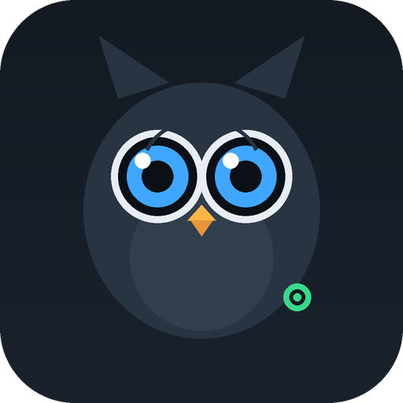

<div align="center">



# Owlet‑To‑RTSP — `beta`

**Where the next features land before they're promoted to `main`/`:latest`.**

</div>

> `main` (the `:latest` image) stays the stable, known‑good build. This `beta`
> branch publishes its **own** image tag — `:beta` — so trying new things never
> touches your working setup.

---

## How to try the beta image

The Unraid template and `docker run` command pull `:latest`. To test beta, point
at the `:beta` tag instead:

- **Unraid:** edit the container → set *Repository* to
  `ghcr.io/btoth525/owlet-bridge-native:beta` → Apply. Roll back any time by
  setting it back to `:latest`.
- **docker run / compose:** change the image to
  `ghcr.io/btoth525/owlet-bridge-native:beta`.

Your `/config` and `/app/libs` volumes carry over unchanged — beta **migrates**
your existing single‑camera setup automatically (see below).

---

## What's new in beta

### 🎥 Multiple cameras
Add as many Owlet cams as you want — each becomes its own RTSP stream.

- The Owlet **Cam** isn't listed on your account (only the Sock is), so cameras
  are added **by DSN** in the **Cameras** card. Give each a name; it becomes the
  stream path: `rtsp://<host>:8554/<name>`.
- **Add & connect** logs into Owlet, fetches that camera's key (KMS), and starts
  its stream — all in one click.
- Each camera has its own status, copy‑ready URLs, a **📷 Snapshot** button, an
  **Advanced** panel (UID / AuthKey / AV password / security mode), and
  **Remove**.
- The internal keepalive now holds **one warm session per camera** and re‑reads
  the list, so adding/removing a camera in the UI takes effect without a restart.

> **Fully backward compatible.** Your existing single camera is migrated to a
> camera named **`owlet`**, so `rtsp://<host>:8554/owlet` (and your Frigate
> config) keeps working untouched.

### 🔁 Self‑healing streams (also shipped to `:latest`)
The stream now re‑fetches a **fresh camera key** from the Owlet cloud on every
(re)connect — the same thing the *Connect & Diagnose* button does, but automatic.
After a container update, power blip, or Frigate restart the camera comes back on
its own; no more manual re‑diagnose. Falls back to the saved key if the cloud is
briefly unreachable. Opt out with `OWLET_REFRESH_KMS=0`.

### 📸 Snapshot endpoints
`GET /img/<name>.jpg` and `GET /snapshot/<name>.jpg` return a still JPEG for a
camera (served by the control panel on `:8088`). Handy for dashboards/Home
Assistant `camera` entities.

### 🔒 Optional Web UI auth
Set `OWLET_UI_USER` and `OWLET_UI_PASS` to require HTTP Basic auth on the control
panel. Off by default.

---

## New env vars (all optional)

| Var | Default | Meaning |
|---|---|---|
| `OWLET_REFRESH_KMS` | `1` | re‑fetch the camera key from Owlet on every (re)connect |
| `OWLET_UI_USER` / `OWLET_UI_PASS` | *(unset)* | require Basic auth on the control panel |
| `OWLET_KEEPALIVE` | `1` | hold one warm session per camera (leave on) |
| `OWLET_VITALS_POLL` | `1` | continuously read sock vitals + cam sensors |
| `OWLET_VITALS_INTERVAL` | `15` | seconds between sock vitals polls |
| `OWLET_SENSORS` | `1` | publish cam room sensors (temp/humidity/noise/…) |
| `OWLET_WEBRTC_CANDIDATE` | *(unset)* | `<host-ip>:8555` for sub‑second WebRTC from phones/other hosts |
| `OWLET_MQTT_HOST` … | *(unset)* | Home Assistant MQTT — **easier to set in the UI** (🏠 card) |

> A glass‑HUD variant of each camera is also exposed on‑demand as
> `<camera>_overlay` (transcoded only when viewed). For app integration —
> sub‑second WebRTC + the full data feed — see
> `native-bridge/docs/app-integration.md`.

### 🩺 Sock vitals + camera room sensors → UI, app & Home Assistant
The bridge reads the **Smart Sock** vitals (heart rate, oxygen, skin temp, sleep
state, battery…) from Owlet's cloud, and the **Owlet Cam's** room sensors
(temperature, humidity, noise, brightness, motion, sound) straight off the TUTK
stream — no cloud needed for the cam (see `native-bridge/docs/owlet-cam-sensors.md`).
All of it is exposed at **`GET /api/vitals`** (°F by default; `?units=metric` for
°C) for the web UI and your own app, and auto‑published to **Home Assistant** via
MQTT discovery when `OWLET_MQTT_HOST` is set. Set `OWLET_OVERLAY=1` to also burn a
glass HUD into the video (otherwise overlay client‑side from `/api/vitals`).

Everything else is unchanged from `:latest`.

---

## How multi‑camera works under the hood

```
/config/owlet.yaml         { account…, "cameras": [ {name, dsn, uid, authkey, …} ] }
        │  (config_store.py — single source of truth, migrates old flat config)
        ▼
render_streams.py  ──▶  /config/cameras/<name>.env   (one per camera)
                   ──▶  /config/go2rtc.gen.yaml       (one exec stream per camera)
        ▼
go2rtc -config /config/go2rtc.gen.yaml      # rtsp://host:8554/<name> for each
keepalive.py                                # one warm internal viewer per camera
```

Adding/removing a camera in the UI rewrites the generated config and restarts
go2rtc. If `/config` isn't writable it falls back to the baked‑in single‑camera
config, exactly like before.

---

## Roadmap — further docker‑wyze‑bridge parity

Candidates, roughly in value order. Nothing here is required for multi‑camera to
work today:

- **On‑demand toggle** — optionally connect a camera only while something is
  watching (`OWLET_ON_DEMAND`), trading the always‑warm session for less load.
- **Home Assistant / MQTT discovery** — publish each camera (and the Sock's
  vitals) as HA entities with snapshots.
- **Audio** — investigate whether the Dream Duo's AV channel carries audio and,
  if so, mux it in.
- **Per‑camera quality / substream** — expose a lower‑res sub‑stream where the
  camera supports it.
- **Reverse‑proxy URL overrides** — `WB_*`‑style external URL hints for the UI.
- **Snapshot intervals + thumbnails on the dashboard.**

Open an issue or just say which of these you want next.
